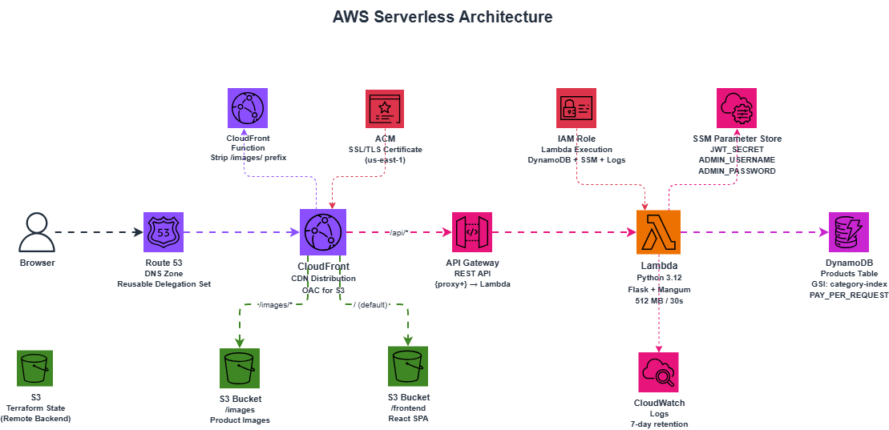
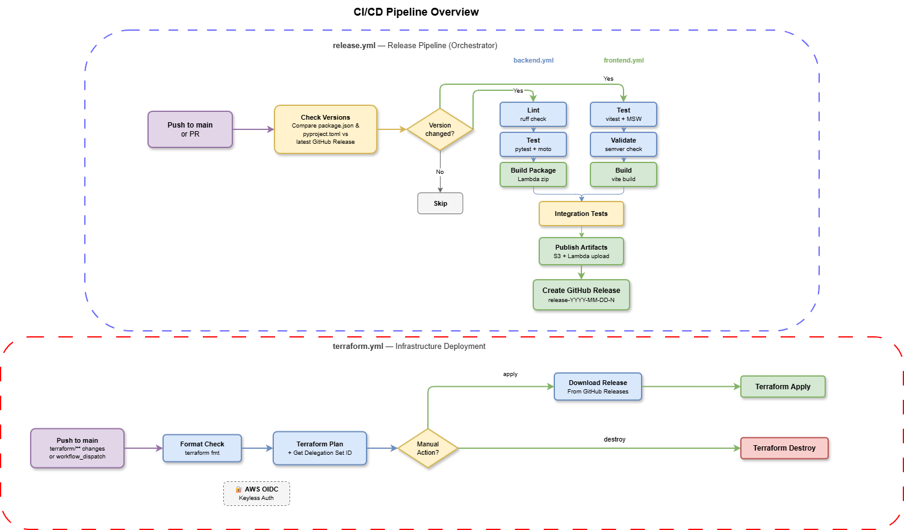

# motorShop Serverless

A full-stack serverless e-commerce application deployed on AWS using Lambda, API Gateway, DynamoDB, S3, CloudFront, and Route 53. Infrastructure is fully managed with Terraform, and CI/CD is automated via GitHub Actions with OIDC-based keyless authentication.

## Architecture



**Request flow:** Browser → CloudFront → routes to S3 (static files at `/`, images at `/images/*`) or API Gateway → Lambda → DynamoDB (API calls at `/api/*`).

## Tech Stack

| Layer          | Technology                                         |
| -------------- | -------------------------------------------------- |
| Frontend       | React 19, React Router 7, Vite 6                  |
| Backend        | Flask 3, Mangum (ASGI adapter), PyJWT, Boto3       |
| Database       | DynamoDB (PAY_PER_REQUEST, GSI on category)        |
| Infrastructure | Terraform 1.5+, AWS Provider 6.55                 |
| CI/CD          | GitHub Actions (OIDC keyless auth)                 |
| Testing        | Vitest + Testing Library (FE), Pytest + Moto (BE)  |
| Linting        | Ruff (BE), ESLint via Vitest (FE)                  |

## Project Structure

```
├── .github/workflows/      # CI/CD pipelines
│   ├── backend.yml          # Backend lint, test, build (reusable)
│   ├── frontend.yml         # Frontend test, build (reusable)
│   ├── release.yml          # Orchestrator: version check → build → publish → release
│   └── terraform.yml        # Infrastructure: fmt → plan → apply/destroy
├── backend/                 # Python Lambda function
│   ├── app/                 # Flask application
│   │   ├── auth/            # JWT authentication
│   │   ├── products/        # Product CRUD (DynamoDB)
│   │   ├── contact/         # Contact form endpoint
│   │   ├── feedback/        # Feedback endpoint
│   │   └── health/          # Health check
│   ├── tests/               # Pytest tests with Moto mocks
│   └── pyproject.toml       # Dependencies (managed by uv)
├── frontend/                # React SPA
│   ├── src/
│   │   ├── components/      # Header, Footer, CategoryMenu, Pagination
│   │   └── pages/           # Home, Blog, Contact, Feedback, ProductInfo
│   ├── tests/               # Vitest + MSW mock handlers
│   └── package.json
└── terraform/
    ├── persistent/          # Long-lived resources (S3 project bucket)
    └── app/                 # Application infrastructure
        └── modules/         # SSM, DynamoDB, IAM, Lambda, API Gateway,
                             # CloudFront, Route53
```

## Prerequisites

- **Python** 3.12+
- **uv** (Python package manager) — [install](https://docs.astral.sh/uv/)
- **Node.js** 24+ and npm
- **Terraform** >= 1.5
- **AWS CLI** v2
- **AWS Account** with OIDC identity provider configured for GitHub Actions

## Important: Reusable Delegation Set (Route 53)

> **You must create a Route 53 Reusable Delegation Set before deploying infrastructure.**

The Route 53 module uses a reusable delegation set so that the nameservers remain consistent across `terraform destroy` / `terraform apply` cycles. This avoids having to update NS records at your external domain registrar every time you redeploy.

**Create it once (manually via AWS CLI):**

```bash
aws route53 create-reusable-delegation-set \
  --caller-reference "motorShop_serverless_delegation_set"
```

This returns a set of 4 NS records. **Add these NS records to your external domain registrar** (e.g., Namecheap, GoDaddy, Cloudflare) pointing your domain to AWS.

The CI/CD pipeline automatically retrieves the delegation set ID using:

```bash
aws route53 list-reusable-delegation-sets \
  --query "DelegationSets[?CallerReference=='motorShop_serverless_delegation_set']" \
  --output json | jq -r '.[].Id | split("/") | last'
```

## Important: ACM SSL/TLS Certificate

CloudFront requires an ACM certificate created in **us-east-1** (regardless of your app region). You need to request and validate a certificate for your domain before deploying CloudFront.

## Local Development

### Backend

```bash
cd backend
uv sync                      # Install dependencies
uv run pytest tests/ -v      # Run tests
uv run ruff check .          # Lint
```

To run the Flask dev server locally:

```bash
cd backend
uv run flask --app app run --port 5000
```

### Frontend

```bash
cd frontend
npm install                  # Install dependencies
npm run dev                  # Start Vite dev server (proxies /api to localhost:5000)
npm run test:run             # Run tests
npm run build                # Production build
```

The Vite dev server proxies `/api` requests to `http://localhost:5000` and `/images` to a local MinIO instance at `http://localhost:9000`.

## CI/CD Pipeline Overview

The project uses **4 GitHub Actions workflows** with OIDC-based keyless AWS authentication (no long-lived access keys).



### 1. `backend.yml` — Backend CI (Reusable)

Triggered on PRs touching `backend/**`, or called by the release pipeline.

```
Lint (ruff check) → Test (pytest) → Build Lambda Package → Upload Artifact
```

### 2. `frontend.yml` — Frontend CI (Reusable)

Triggered on PRs touching `frontend/**`, or called by the release pipeline.

```
Install → Test (vitest) → Validate Semver → Build (vite build) → Upload Artifact
```

### 3. `release.yml` — Release Pipeline (Orchestrator)

Triggered on push to `main` or manual dispatch. Coordinates the full release process:

```
Check Versions (compare with latest GitHub Release)
        │
        ├── (version changed?) ──► Call backend.yml + frontend.yml (parallel)
        │                                     │
        │                              Integration Tests
        │                                     │
        │                              Publish Artifacts (S3 + Lambda)
        │                                     │
        │                              Create GitHub Release
        │                                (release-YYYY-MM-DD-N)
        │
        └── (no change?) ──► Skip
```

- Versions are read from `frontend/package.json` and `backend/pyproject.toml`
- A release is only created when at least one version changes
- Release tag format: `release-YYYY-MM-DD-N` (auto-incrementing counter per day)

### 4. `terraform.yml` — Infrastructure Deployment

Triggered on PRs/pushes touching `terraform/**`, or manual dispatch with action choice.

```
Format Check (terraform fmt)
        │
   Terraform Plan
        │
        ├── (manual: apply) ──► Download Release Artifacts → Terraform Apply
        │
        └── (manual: destroy) ──► Terraform Destroy
```

- Plan runs automatically on PRs; Apply/Destroy require manual `workflow_dispatch`
- Downloads release artifacts from GitHub Releases for deployment

### Required GitHub Secrets

| Secret             | Description                                    |
| ------------------ | ---------------------------------------------- |
| `AWS_ROLE_ARN`     | IAM Role ARN for OIDC (GitHub → AWS)           |
| `JWT_SECRET`       | Secret key for JWT token signing               |
| `ADMIN_USERNAME`   | Admin username for the API                     |
| `ADMIN_PASSWORD`   | Admin password for the API                     |
| `AWS_PROJECT_S3_BUCKET` | S3 bucket name for the project            |

### Required GitHub Variables

| Variable           | Description                  |
| ------------------ | ---------------------------- |
| `PERSONAL_EMAIL`   | Alert notification email     |

## Terraform Infrastructure

Infrastructure is split into two layers:

### `terraform/persistent/`

Long-lived resources that survive application redeployments:

- **S3 Bucket** — Stores frontend dist, product images, and Lambda packages. Configured with SSE (AES256) and public access blocked.

### `terraform/app/`

Application-level resources (modularized):

| Module       | Resources                                                       |
| ------------ | --------------------------------------------------------------- |
| `ssm`        | SSM SecureString parameters (JWT secret, admin credentials)     |
| `dynamodb`   | Products table with category GSI + seed data script             |
| `iam`        | Lambda execution role with DynamoDB, SSM, and CloudWatch access |
| `lambda`     | Python 3.12 function (512 MB, 30s timeout)                      |
| `apigateway` | REST API with `{proxy+}` catch-all route → Lambda              |
| `cloudfront` | Distribution with 3 origins (frontend S3, images S3, API GW)   |
| `route53`    | Hosted zone with alias records to CloudFront                    |

State is stored remotely in S3 with lock file enabled.

## API Endpoints

| Method | Path                       | Auth     | Description          |
| ------ | -------------------------- | -------- | -------------------- |
| GET    | `/api/health/`             | Public   | Health check         |
| GET    | `/api/products/`           | Public   | List products        |
| GET    | `/api/products/categories/`| Public   | List categories      |
| GET    | `/api/products/<id>/info`  | Public   | Get product details  |
| POST   | `/api/products/`           | JWT      | Create product       |
| POST   | `/api/auth/login`          | Public   | Login (returns JWT)  |
| POST   | `/api/contact/`            | Public   | Submit contact form  |
| POST   | `/api/feedback/`           | Public   | Submit feedback      |

## Deployment

### First-Time Setup

1. **Create the Reusable Delegation Set** (see [above](#important-reusable-delegation-set-route-53))
2. **Request an ACM certificate** in `us-east-1` for your domain
3. **Deploy persistent resources:**
   ```bash
   cd terraform/persistent
   terraform init && terraform apply
   ```
4. **Configure GitHub Secrets and Variables** (see table above)
5. **Copy and fill in Terraform variables:**
   ```bash
   cp terraform/app/terraform.tfvars.example terraform/app/terraform.tfvars
   # Edit terraform.tfvars with your values
   ```
6. **Push to `main`** to trigger the release pipeline, then use `workflow_dispatch` on `terraform.yml` with action `apply`

### Subsequent Deployments

1. Bump the version in `frontend/package.json` or `backend/pyproject.toml`
2. Push to `main` — the release pipeline builds, tests, and creates a GitHub Release
3. Trigger `terraform.yml` with `workflow_dispatch` → `apply` to deploy the new release